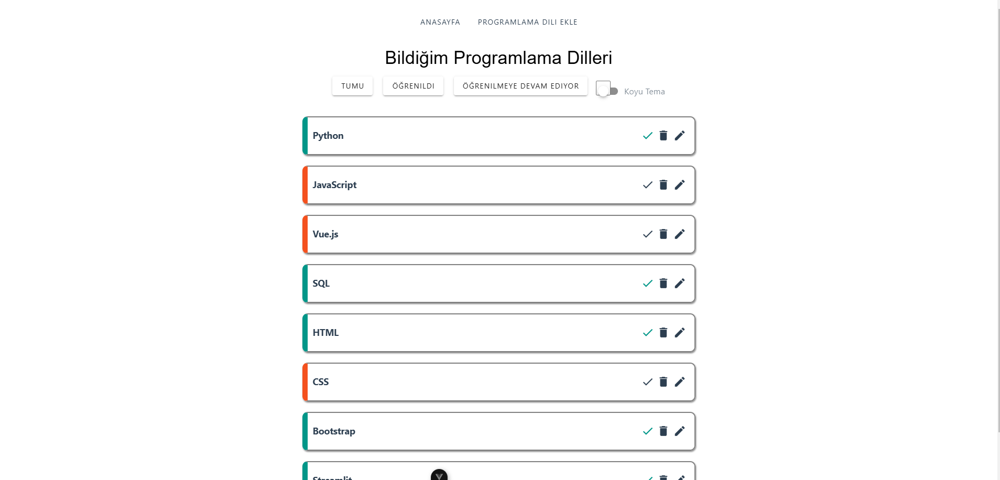
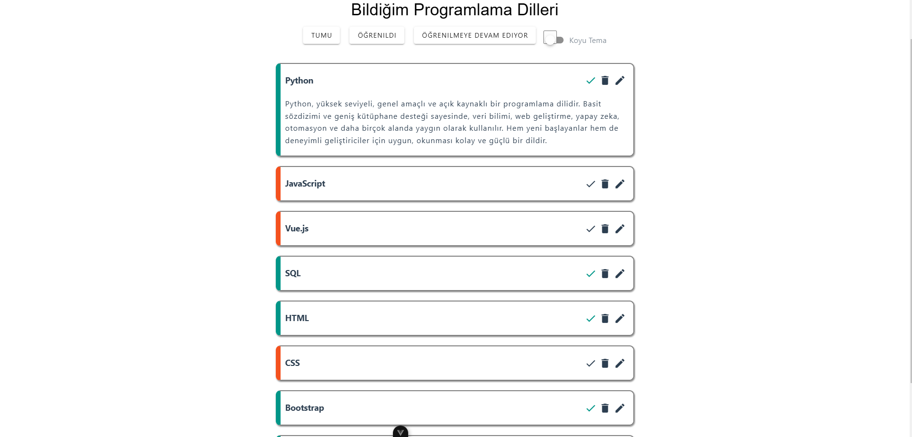
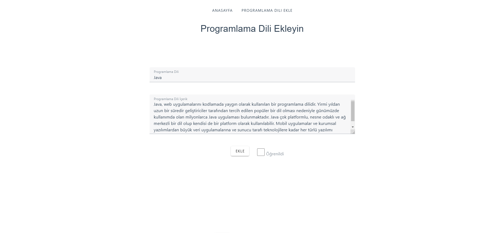
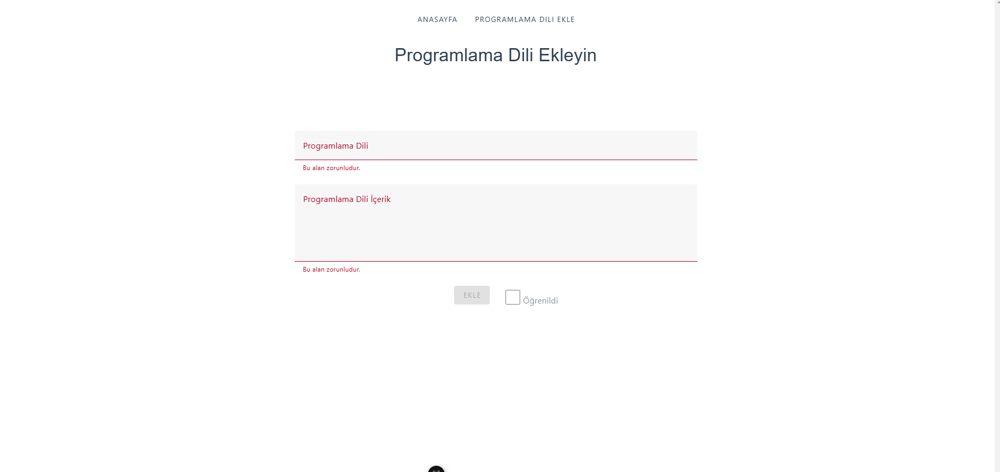

# Vue-Programlama-Dili-Ekleyici
Bir Vue.js uygulaması ile programlama dillerinizi ekleyip yönetebilir, öğrenim durumunuzu takip edebilirsiniz.


## Özellikler
- Programlama dillerini ekleyebilme
- Ekleme işlemlerini kaydedebilme ve düzenleyebilme
- JSON Server ile veritabanı yönetimi
- Verilerin liste şeklinde görüntülenmesi


## Ekran Görüntüsü








## Teknolojiler
- Vue.js
- JSON Server
- db.json
- HTML
- CSS
- JavaScript


## Kurulum

### Gereksinimler

- Node.js

### Adım Adım Kurulum


1.**Projenin GitHub'dan İndirilmesi**:
   ```bash
   git clone https://github.com/EmirBaranKadirhan/Vue-Programlama-Dili-Ekleyici.git
   ```
2.**Proje Klasörüne Geçiş**:
   ```bash
   cd Vue-Programlama-Dili-Ekleyici
   ```
3.**Bağımlılıkların Yüklenmesi**:
   ```bash
   npm install
   ```
4.**Projenin Çalıştırılması**:
   ```bash
   npm run serve
   ```
5.**JSON Server'ın Kurulması ve Çalıştırılması:**:
   ```bash
   npm install -g json-server
   json-server --watch db.json
   ```   
 

## Kullanım
Projeyi çalıştırdıktan sonra, Vue.js uygulamanız üzerinde yeni programlama dilleri ekleyebilir ve JSON Server üzerinde bu verileri görüntüleyebilirsiniz. Veritabanı db.json dosyasında tutulur ve bu dosya güncellemelerle otomatik olarak senkronize edilir.

## Katkıda Bulunma
Eğer bu projeye katkıda bulunmak istiyorsanız, lütfen bir pull request göndermeden önce issue oluşturun ve önerilerinizi paylaşın.


